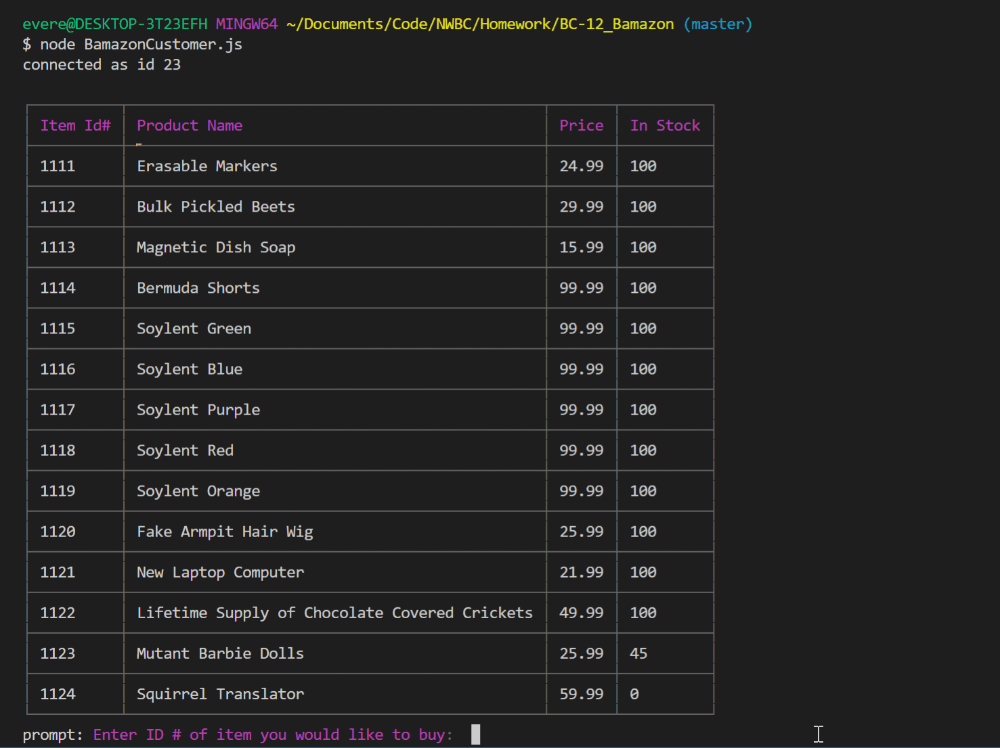
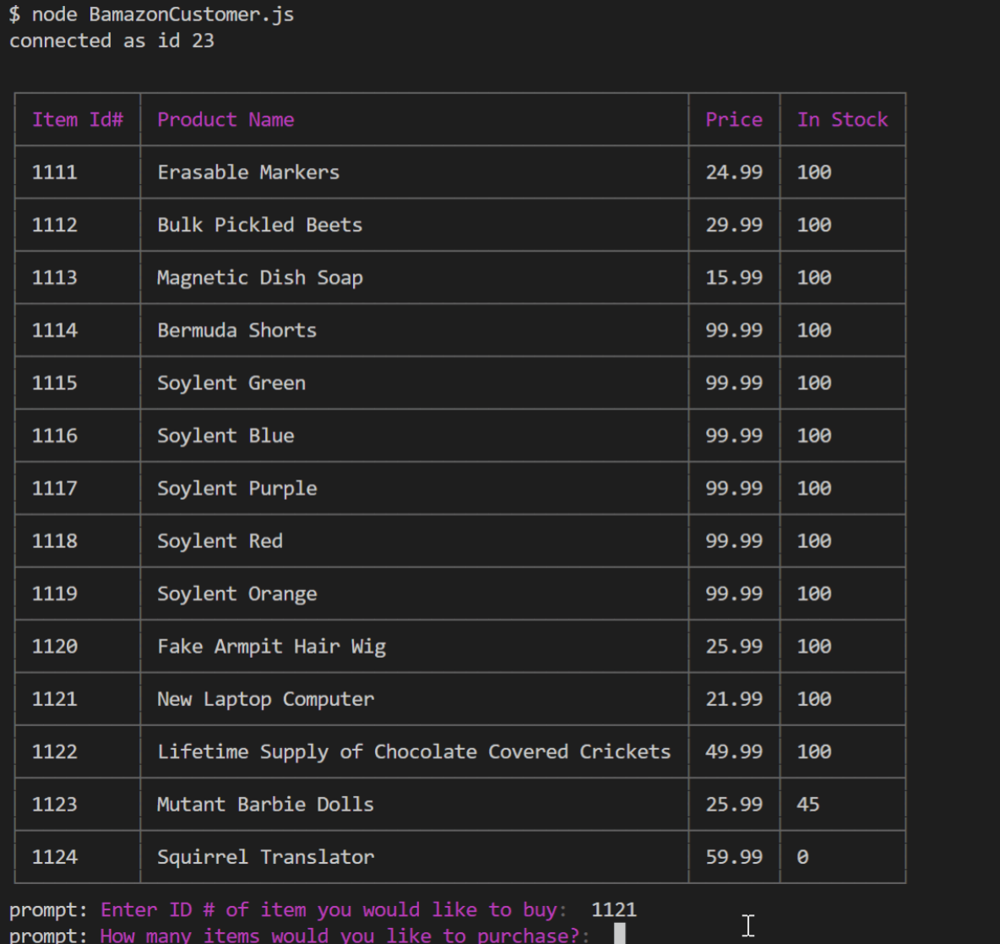

# Node.js & MySQL - bamazon Storefront

## Overview

This is an Amazon-like storefront made with MySql and Node.  

## Demo

The only module complete so far is for the customer.  

## History

A class project for Northwestern Coding Bootcamp. 

## Credits

Author: Caitlin Everett 
Teachers: NWBC Folks!

## Technologies

JS, nodeJS, MySQL
npm packages:
  - mysql
  - prompt
  - colors/safe
  - cli-table 
